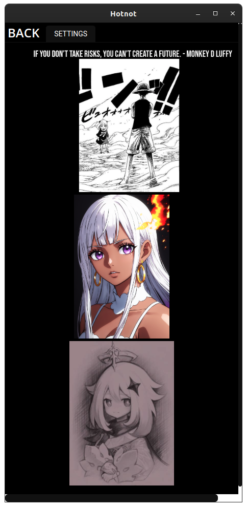
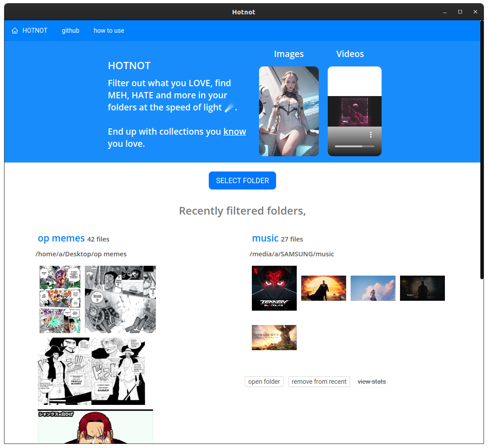
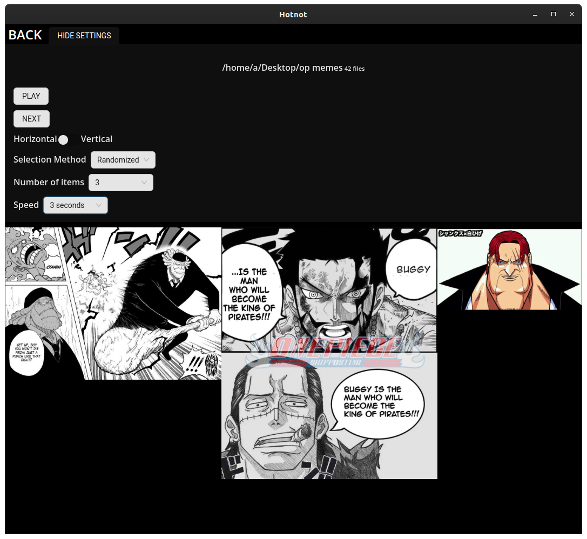
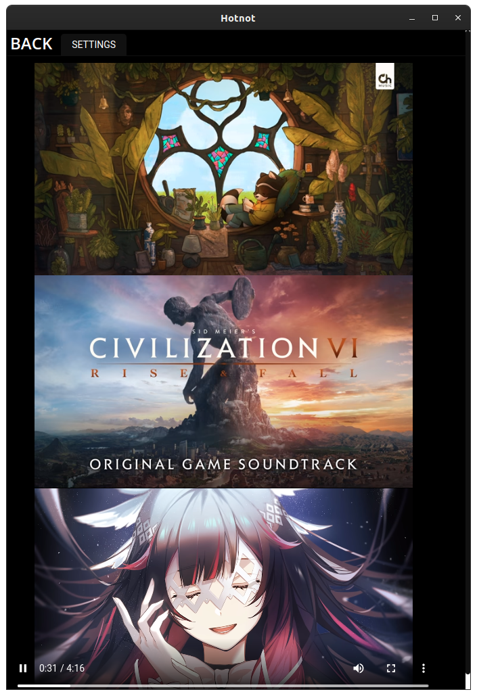
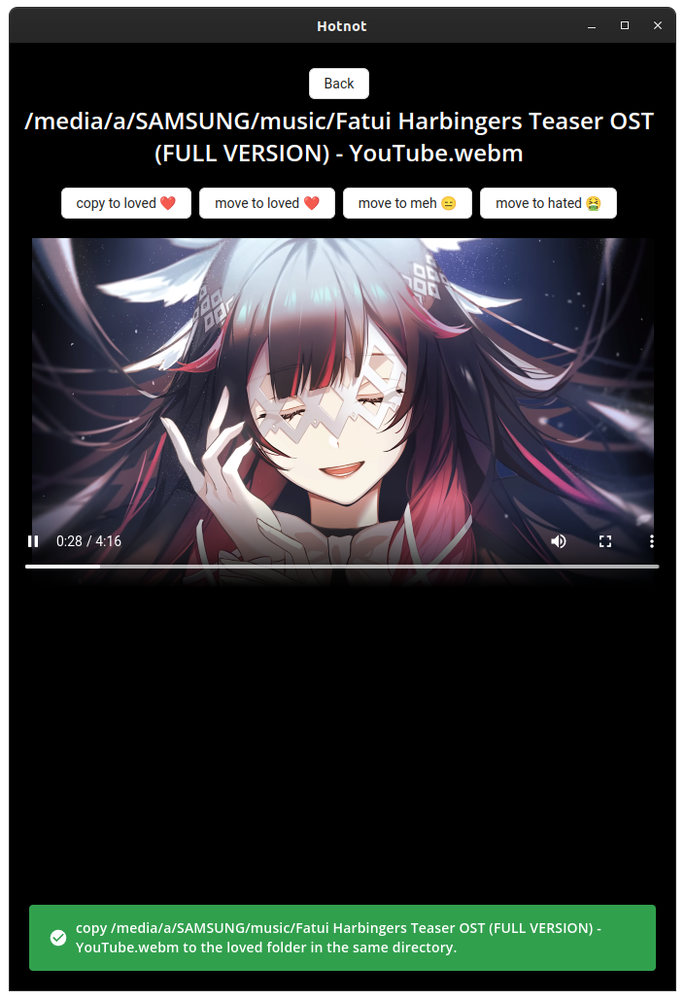

# Problem: You have too much content.

You want to create a 'fine-tuned' set, maybe for AI image generation.

Result: It can be effortful to do so.

Hotnot attempts to provide a simple interface for casual filtering of media (images and video) 'on the side'.

It's intended use loop is:
 - Leave it running on the side of screen while doing other things
 - As it displays content from your selected folder, anything you don't particularly like, you can move to dislike/meh folders.
 - Eventually you should end up with a collection that you know you love.

Note: Mainly for personal use..

